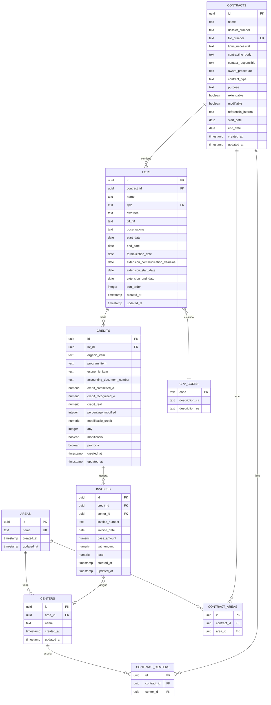

# Esquema de Base de Datos - IMAS Contract Manager

## Diagrama de Relaciones (ERD)



## Tablas Principales

### 1. **areas**
Áreas organizativas del IMAS.

| Campo | Tipo | Restricciones | Descripción |
|-------|------|---------------|-------------|
| `id` | UUID | PK, DEFAULT gen_random_uuid() | Identificador único |
| `name` | TEXT | UNIQUE, NOT NULL | Nombre del área |
| `created_at` | TIMESTAMPTZ | DEFAULT now() | Fecha de creación |
| `updated_at` | TIMESTAMPTZ | DEFAULT now() | Fecha de actualización |

**Datos semilla**: "Atenció Sociosanitària", "Atenció Comunitaria i Promoció de la Autonomia Personal"

---

### 2. **centers**
Centros residenciales y servicios.

| Campo | Tipo | Restricciones | Descripción |
|-------|------|---------------|-------------|
| `id` | UUID | PK, DEFAULT gen_random_uuid() | Identificador único |
| `area_id` | UUID | FK → areas(id), NOT NULL | Área a la que pertenece |
| `name` | TEXT | NOT NULL | Nombre del centro |
| `created_at` | TIMESTAMPTZ | DEFAULT now() | Fecha de creación |
| `updated_at` | TIMESTAMPTZ | DEFAULT now() | Fecha de actualización |

**Constraint**: `UNIQUE(area_id, name)`

---

### 3. **contracts**
Contratos marco.

| Campo | Tipo | Restricciones | Descripción |
|-------|------|---------------|-------------|
| `id` | UUID | PK, DEFAULT gen_random_uuid() | Identificador único |
| `name` | TEXT | NOT NULL | Nombre del contrato |
| `dossier_number` | TEXT | | Número de dossier |
| `file_number` | TEXT | UNIQUE | Número de expediente |
| `tipus_necessitat` | TEXT | CHECK IN ('Puntual', 'Recurrent') | Tipo de necesidad |
| `contracting_body` | TEXT | | Órgano de contratación |
| `contact_responsible` | TEXT | | Responsable de contacto |
| `award_procedure` | TEXT | | Procedimiento de adjudicación |
| `contract_type` | TEXT | | Tipo contractual |
| `purpose` | TEXT | | Objeto del contrato |
| `need_to_satisfy` | TEXT | | Necesidad a satisfacer |
| `observations` | TEXT | | Observaciones |
| `extendable` | BOOLEAN | DEFAULT false | ¿Es prorrogable? |
| `modifiable` | BOOLEAN | DEFAULT false | ¿Es modificable? |
| `referencia_interna` | TEXT | | Referencia interna |
| `start_date` | DATE | | Fecha de inicio |
| `end_date` | DATE | | Fecha de fin |
| `created_at` | TIMESTAMPTZ | DEFAULT now() | Fecha de creación |
| `updated_at` | TIMESTAMPTZ | DEFAULT now() | Fecha de actualización |

---

### 4. **contract_areas** (Tabla de relación N:M)
Asociación entre contratos y áreas.

| Campo | Tipo | Restricciones | Descripción |
|-------|------|---------------|-------------|
| `id` | UUID | PK | Identificador único |
| `contract_id` | UUID | FK → contracts(id) ON DELETE CASCADE | Contrato |
| `area_id` | UUID | FK → areas(id) ON DELETE CASCADE | Área |

**Constraint**: `UNIQUE(contract_id, area_id)`

---

### 5. **contract_centers** (Tabla de relación N:M)
Asociación entre contratos y centros.

| Campo | Tipo | Restricciones | Descripción |
|-------|------|---------------|-------------|
| `id` | UUID | PK | Identificador único |
| `contract_id` | UUID | FK → contracts(id) ON DELETE CASCADE | Contrato |
| `center_id` | UUID | FK → centers(id) ON DELETE CASCADE | Centro |

**Constraint**: `UNIQUE(contract_id, center_id)`

---

### 6. **lots**
Lotes específicos de un contrato.

| Campo | Tipo | Restricciones | Descripción |
|-------|------|---------------|-------------|
| `id` | UUID | PK, DEFAULT gen_random_uuid() | Identificador único |
| `contract_id` | UUID | FK → contracts(id) ON DELETE CASCADE | Contrato padre |
| `name` | TEXT | NOT NULL | Nombre del lote |
| `cpv` | TEXT | FK → cpv_codes(code) | Código CPV |
| `awardee` | TEXT | | Adjudicatario |
| `awardee_email` | TEXT | | Email del adjudicatario |
| `cif_nif` | TEXT | | CIF/NIF del adjudicatario |
| `observations` | TEXT | | Observaciones |
| `start_date` | DATE | | Fecha de inicio |
| `end_date` | DATE | | Fecha de fin |
| `formalization_date` | DATE | | Fecha de formalización |
| `extension_communication_deadline` | DATE | | Plazo comunicación prórroga |
| `extension_start_date` | DATE | | Inicio de prórroga |
| `extension_end_date` | DATE | | Fin de prórroga |
| `sort_order` | INTEGER | DEFAULT 0 | Orden de visualización |
| `created_at` | TIMESTAMPTZ | DEFAULT now() | Fecha de creación |
| `updated_at` | TIMESTAMPTZ | DEFAULT now() | Fecha de actualización |

---

### 7. **credits**
Asignaciones presupuestarias anuales por lote.

| Campo | Tipo | Restricciones | Descripción |
|-------|------|---------------|-------------|
| `id` | UUID | PK, DEFAULT gen_random_uuid() | Identificador único |
| `lot_id` | UUID | FK → lots(id) ON DELETE CASCADE | Lote padre |
| `organic_item` | TEXT | | Partida orgánica |
| `program_item` | TEXT | | Partida de programa |
| `economic_item` | TEXT | | Partida económica |
| `accounting_document_number` | TEXT | | Número de documento contable |
| `credit_committed_d` | NUMERIC(12,2) | DEFAULT 0, NOT NULL | Crédito comprometido (D) |
| `credit_recognized_o` | NUMERIC(12,2) | DEFAULT 0, NOT NULL | Crédito reconocido (O) |
| `credit_real` | NUMERIC(12,2) | DEFAULT 0, NOT NULL | Crédito real (D - O) |
| `percentage_modified` | INTEGER | DEFAULT 0 | Porcentaje modificado |
| `modificacio_credit` | NUMERIC(10,2) | DEFAULT 0 | Modificación de crédito |
| `any` | INTEGER | DEFAULT 2024, NOT NULL | Año del crédito |
| `modificacio` | BOOLEAN | DEFAULT false | ¿Es una modificación? |
| `prorroga` | BOOLEAN | DEFAULT false | ¿Es una prórroga? |
| `created_at` | TIMESTAMPTZ | DEFAULT now() | Fecha de creación |
| `updated_at` | TIMESTAMPTZ | DEFAULT now() | Fecha de actualización |

---

### 8. **invoices**
Facturas asociadas a créditos (ejecución real del gasto).

| Campo | Tipo | Restricciones | Descripción |
|-------|------|---------------|-------------|
| `id` | UUID | PK, DEFAULT gen_random_uuid() | Identificador único |
| `credit_id` | UUID | FK → credits(id) ON DELETE CASCADE | Crédito asociado |
| `center_id` | UUID | FK → centers(id) | Centro de imputación |
| `invoice_number` | TEXT | NOT NULL | Número de factura |
| `invoice_date` | DATE | NOT NULL | Fecha de factura |
| `base_amount` | NUMERIC(12,2) | NOT NULL | Base imponible |
| `vat_amount` | NUMERIC(12,2) | NOT NULL | IVA |
| `total` | NUMERIC(12,2) | DEFAULT 0, NOT NULL | Total (calculado automáticamente) |
| `created_at` | TIMESTAMPTZ | DEFAULT now() | Fecha de creación |
| `updated_at` | TIMESTAMPTZ | DEFAULT now() | Fecha de actualización |

---

### 9. **cpv_codes**
Códigos CPV (Common Procurement Vocabulary) para clasificación de contratos.

| Campo | Tipo | Restricciones | Descripción |
|-------|------|---------------|-------------|
| `code` | TEXT | PK | Código CPV |
| `description_ca` | TEXT | | Descripción en catalán |
| `description_es` | TEXT | | Descripción en español |

---

## Índices

```sql
CREATE INDEX idx_contracts_contract_type ON contracts(contract_type);
CREATE INDEX idx_lots_contract_id ON lots(contract_id);
CREATE INDEX idx_credits_lot_id ON credits(lot_id);
CREATE INDEX idx_invoices_credit_id ON invoices(credit_id);
CREATE INDEX idx_contract_areas_contract_id ON contract_areas(contract_id);
CREATE INDEX idx_contract_areas_area_id ON contract_areas(area_id);
CREATE INDEX idx_contract_centers_contract_id ON contract_centers(contract_id);
CREATE INDEX idx_contract_centers_center_id ON contract_centers(center_id);
CREATE INDEX idx_centers_area_id ON centers(area_id);
```

---

## Triggers y Funciones

### 1. **update_updated_at_column()**
Actualiza automáticamente el campo `updated_at` en todas las tablas.

### 2. **calculate_invoice_total()**
Calcula automáticamente `total = base_amount + vat_amount` en facturas.

### 3. **update_credit_recognized()**
Actualiza `credit_recognized_o` y `credit_real` cuando se insertan/modifican/eliminan facturas.

### 4. **update_credit_real()**
Calcula `credit_real = credit_committed_d - credit_recognized_o` cuando cambian los créditos.

---

## Row Level Security (RLS)

Todas las tablas tienen RLS habilitado con política:
```sql
CREATE POLICY "Allow all for authenticated" ON [tabla] 
FOR ALL TO authenticated USING (true) WITH CHECK (true);
```

Esto permite todas las operaciones a usuarios autenticados de Supabase.
